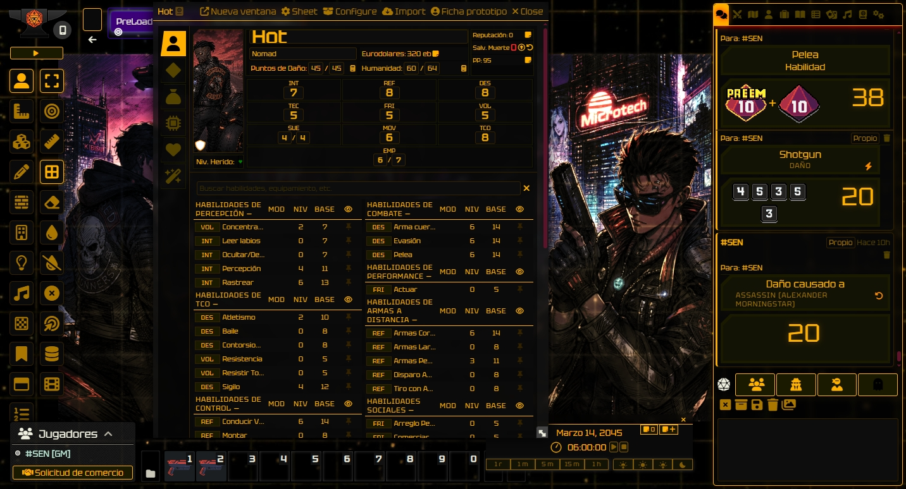
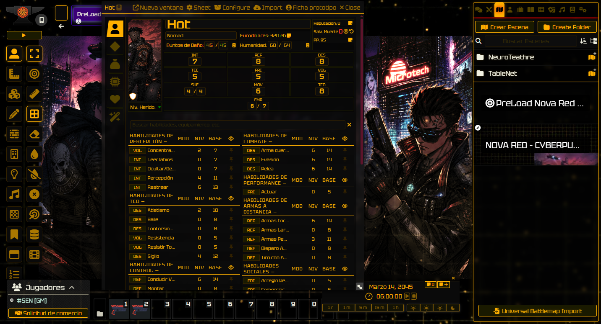
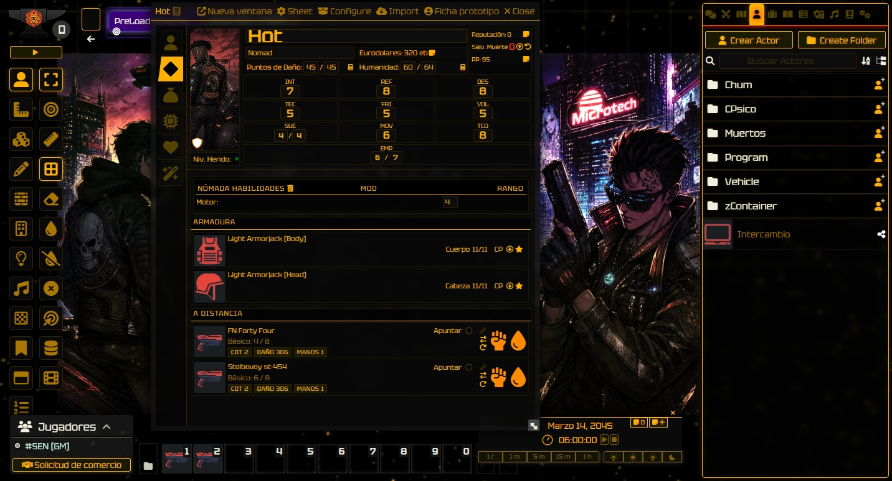
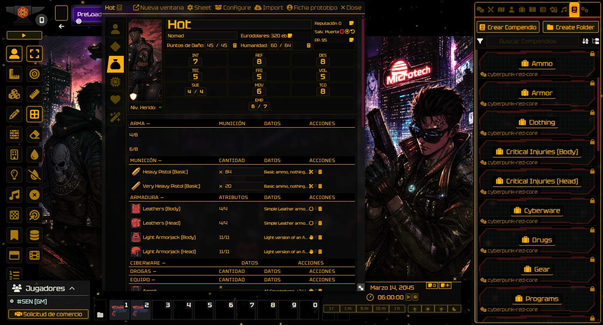

```text
╔══════════════════════════════════════════════════════════╗
║        █▄▄▄ █ █ ▄▀▄ ▄▀▄   █▀▄▄▀█ ██ █ █▀▄             ║
║        █▄▄  █▄█ ▀▄▀ ▀▄▀   █ ▀▀ █ █▄█ █ █▀              ║
║                                                          ║
║    █▀▄▀█ █▀▀█ █▀▀  █ █   █▀▀ █▀▀█ █▀▀  █▀▀█            ║
║    █ ▀ █ █▄▄█ ▀▀█  █▄█   █   █▄▄█ ▀▀█  █▄▄█            ║
║    ▀   ▀ ▀  ▀ ▀▀▀  ▄▀▄   ▀▀▀ ▀  ▀ ▀▀▀  ▀  ▀            ║
╚══════════════════════════════════════════════════════════╝
```


> **🌐 English** · [Español](README.es.md)

# Nova Red UI

> **Yellow-on-black theme for Cyberpunk RED Core (Foundry VTT).**  
> Glass interface, vertical layout, Nova Red terminal aesthetic.

---

## Installation

Add this manifest URL in Foundry VTT:

```
https://github.com/DKSEN404/nova-red-ui/releases/latest/download/module.json
```

**Module:** `System → Modules → Install Module → Paste manifest URL`

---

## Features

- **Glass Interface** — Windows, sidebar, and panels with transparency and blur(4px)
- **Vertical Layout** — Character and mook sheets with side-tab navigation
- **Full Override** — CSS `--cpr-*` variables overwritten — works without modifying the system
- **Custom Templates** — 7 Handlebars templates replacing system ones via `registerPartial`
- **100% CSS/JS** — No external images, no additional dependencies
- **Compatible** — Foundry VTT v12, Cyberpunk RED Core v0.92.4+

---

## Preview

| | |
|:---:|:---:|
|  |  |
|  |  |

---

## Changelog

### v1.0.5 — Player UI & Semantic Colors *(2026-05-28)*
- **Player List** — sidebar `#players` styled with glass, borders and hover
- **Player Config** — permission grid with table, selects and green accept button
- **User Management** — user table with alternating rows, controls and green save button
- **Semantic Colors** — `--nv-color-success` (green) and `--nv-color-danger` (red) variables that adapt to the theme
- **Chameleon fix**: death saves, wounded, failures → red; successes, online, accept → green
- **Danger buttons** — `.kick-player`, `.delete-user`, `button.delete` in red

### v1.0.4 — Theme-Neutral: Chameleon Mode *(2026-05-28)*
- **Chameleon Mode** — module no longer forces the yellow theme, adapts to the user's theme color
- Removed all `--cpr-*` declarations from `:root` that were overriding the system theme
- `--nv-accent`, `--nv-border`, `--nv-bg-*`, `--nv-text-*` variables referencing the system's `--cpr-*` variables
- Glows and shadows adapt to theme via `color-mix()` with yellow fallback for legacy browsers
- 521+ hardcoded colors replaced with CSS variable references
- Compatible with yellow, blue, green, red themes — any color works automatically

### v1.0.3 — Glass Effect in Vertical Layout *(2026-05-28)*
- Full glass/transparency effect in character and mook vertical layout
- Complete coverage: `.character-vertical`, `.mook-sheet-vertical`, `.sheet-vertical`, `.profile-header`, `.stats-bar`, `.mook-header`, `.navtabs-side`, tab-content, skills, combat, equipment, notes
- `backdrop-filter: blur(4px)` on main vertical layout containers
- `--nv-glass-*` variables applied to all inner panels of the vertical layout
- Inputs, selects, and buttons keep solid background for usability

### v1.0.2 — Vertical Layout & Theme Override *(2026-05-28)*
- New vertical layout for character (`.character-vertical`) and mook (`.mook-sheet-vertical`) sheets
- 7 custom module templates for system independence:
  - `cpr-character-sheet.hbs`, `cpr-mook-sheet.hbs`
  - `character/cpr-sheet-header.hbs`, `cpr-profile-tab.hbs`, `cpr-rolefight-tab.hbs`
  - `mook/cpr-mook-tab1.hbs`, `cpr-mook-tab2.hbs`
- Full CSS `--cpr-*` variable override for yellow/black theme without modifying the system
- Cyberpunk grid pattern background (`html[data-cpr-theme="default"]`)
- Partial registration via `Handlebars.registerPartial` for clean installations
- Monkey-patch of sheet templates to use the module's templates
- 100% compatibility with Foundry VTT v12, no external dependencies

### v1.0.1 — Glass Interface *(2026-05-28)*
- Glass/transparency effect with `backdrop-filter: blur(4px)` on all system windows
- Sidebar, actor sheets, item sheets, dialogs, journal, notifications, chat tooltips
- 4 customizable CSS variables: `--nv-glass-{deep,dark,mid,light}`
- Interactive elements (inputs, buttons, selects) keep solid background for usability
- Clean code: CSS only, no extra JS, no images

---

## Credits

| Resource | Source |
|----------|--------|
| Original module | **scifi-ui** by iotech |
| Tab Icons | Rexard 7000 Icons Bundle (licensed) |
| Tables | Font Awesome via Wikimedia Commons (CC BY) |
| Chat bubble | Adapted from CoreUI Icons (CC BY) |
| Sidebar frame | Original by iotech |
| Left/Right arrows | Hexagonal Icon (CC BY SA) |
| Buttons | imacat — Public Domain (OpenGameArt) |
| Denim075 | Atropos (FoundryVTT) |

## License

This work (except graphics) is licensed under **CC BY 4.0**.  
https://creativecommons.org/licenses/by/4.0/
